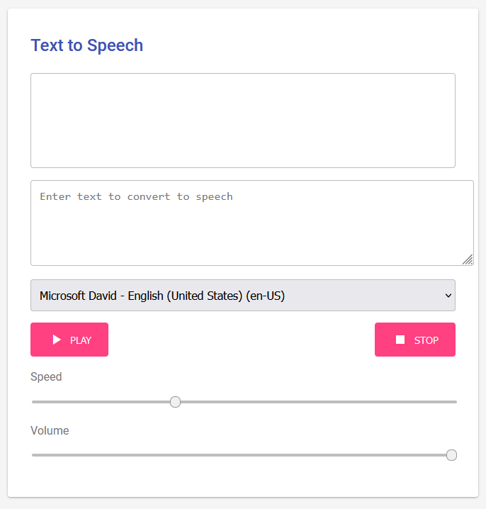

# Text to Speech App

// Start Generation Here
This Text to Speech App allows users to convert written text into spoken words using advanced speech synthesis technology. 

## Features

- **User-Friendly Interface**: The app features a clean and intuitive interface that makes it easy for users to input text and control playback.
  
- **Voice Selection**: Users can choose from a variety of voices to customize their listening experience. The app automatically loads available voices from the browser's speech synthesis capabilities.

- **Adjustable Speed and Volume**: The app provides sliders to adjust the speed and volume of the speech output, allowing users to tailor the audio to their preferences.

- **Play and Stop Controls**: Simple buttons allow users to play or stop the speech output with ease.

- **Real-Time Text Display**: As the text is being read aloud, the app displays the current text being spoken, enhancing the user experience.

This app is designed to be accessible and efficient, making it a great tool for anyone looking to convert text to speech for various applications, including education, accessibility, and entertainment.

